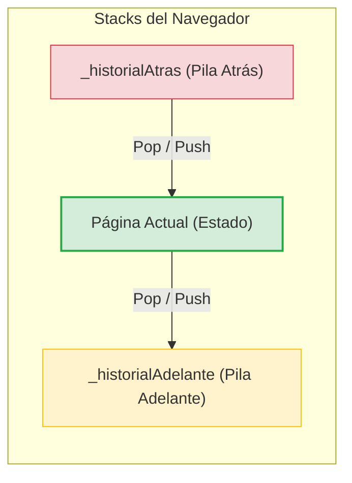

# Simulador de Historial de Navegador Web con Pilas (Stacks) en C#

Este repositorio contiene la solución a la **Guía de Prácticas #02** de la asignatura **Estructura de Datos** de la **Universidad Estatal Amazónica**. La práctica implementa y analiza el comportamiento de la estructura de datos lineal **Pila (Stack)** para simular la navegación web bidireccional (Atrás / Adelante) utilizando el principio **LIFO** (Last-In, First-Out).

---

## 🚀 Características Principales

*   **Arquitectura de Doble Pila**: Implementación de dos pilas dinámicas de tipo `Stack<PaginaWeb>` para modelar:
    *   `_historialAtras`: Guarda el historial de navegación para retroceder.
    *   `_historialAdelante`: Almacena de forma temporal los sitios retrocedidos para permitir adelantar páginas.
*   **Interfaz de Consola Interactiva (CLI)**: Menú interactivo estructurado con colores y validaciones de datos para realizar visitas, retrocesos, avances y visualización del estado interno de las pilas.
*   **Módulo de Benchmark**: Simulación automatizada con **100,000 elementos** que calcula los tiempos de ejecución promedio en **nanosegundos** y comprueba empíricamente la complejidad temporal constante $O(1)$ de las pilas.
*   **Reporte Académico**: Reporte final compilado en formato PDF (`PE_CAHUASQUI.pdf`) que contiene la fundamentación teórica, análisis de complejidad y resultados de la práctica.

---

## 📊 Arquitectura del Historial

La navegación web bidireccional se modela a través de la interacción de dos pilas independientes y la página activa actual:



*   **Retroceder**: `_historialAdelante.Push(PaginaActual)` $\rightarrow$ `PaginaActual = _historialAtras.Pop()`
*   **Adelantar**: `_historialAtras.Push(PaginaActual)` $\rightarrow$ `PaginaActual = _historialAdelante.Pop()`
*   **Visitar**: `_historialAtras.Push(PaginaActual)` $\rightarrow$ `PaginaActual = nuevaPagina` $\rightarrow$ `_historialAdelante.Clear()`

---

## Simulación de la Ejecución (Consola)

El programa incluye un parámetro `--demo` para realizar una ejecución secuencial autogestionada y medir el rendimiento del sistema sin necesidad de ingreso manual de datos.

A continuación se muestra la salida real de la simulación de consola:

```text
====================================================================
          DEMO AUTOMATIZADO: SIMULACIÓN DE NAVEGADOR DE INTERNET    
====================================================================

[1] Navegando a: Google, GitHub y Stack Overflow...
--------------------------------------------------------------------
PÁGINA ACTUAL: Stack Overflow (https://stackoverflow.com) - Accedido: 00:51:29
PILA ATRÁS (Elementos: 2)
   * GitHub (https://www.github.com)
   * Google (https://www.google.com)
PILA ADELANTE (Elementos: 0)
--------------------------------------------------------------------


[2] Retrocediendo una vez (Atrás)...
--------------------------------------------------------------------
PÁGINA ACTUAL: GitHub (https://www.github.com) - Accedido: 00:51:29
PILA ATRÁS (Elementos: 1)
   * Google (https://www.google.com)
PILA ADELANTE (Elementos: 1)
   * Stack Overflow (https://stackoverflow.com)
--------------------------------------------------------------------


[3] Retrocediendo de nuevo (Atrás)...
--------------------------------------------------------------------
PÁGINA ACTUAL: Google (https://www.google.com) - Accedido: 00:51:29
PILA ATRÁS (Elementos: 0)
PILA ADELANTE (Elementos: 2)
   * GitHub (https://www.github.com)
   * Stack Overflow (https://stackoverflow.com)
--------------------------------------------------------------------


[4] Adelantando una vez (Adelante)...
--------------------------------------------------------------------
PÁGINA ACTUAL: GitHub (https://www.github.com) - Accedido: 00:51:29
PILA ATRÁS (Elementos: 1)
   * Google (https://www.google.com)
PILA ADELANTE (Elementos: 1)
   * Stack Overflow (https://stackoverflow.com)
--------------------------------------------------------------------


[5] Visitando un nuevo sitio (Microsoft) -> Limpia la pila Adelante.
--------------------------------------------------------------------
PÁGINA ACTUAL: Microsoft (https://www.microsoft.com) - Accedido: 00:51:29
PILA ATRÁS (Elementos: 2)
   * GitHub (https://www.github.com)
   * Google (https://www.google.com)
PILA ADELANTE (Elementos: 0)
--------------------------------------------------------------------


[6] Ejecutando Benchmark de rendimiento (100,000 elementos)...
====================================================================
           SIMULACIÓN DE RENDIMIENTO (BENCHMARK DE LA PILA)        
====================================================================
Esta simulación realiza inserciones (Push) y extracciones (Pop) a gran
escala para demostrar empíricamente la complejidad O(1) de las pilas.
Se insertarán y extraerán 100,000 páginas en el historial.

- Inserción (Push) de 100,000 elementos:
  * Tiempo total: 49 ms (49,332,379 ticks)
  * Tiempo promedio por Push: 493.32 ns
  * Complejidad experimental: O(1) [Constante]

- Extracción (Pop) de 99,999 elementos:
  * Tiempo total: 26 ms (26,903,167 ticks)
  * Tiempo promedio por Pop: 269.03 ns
  * Complejidad experimental: O(1) [Constante]

[Conclusión] Las operaciones no dependen del número de elementos almacenados,
lo que valida teórica y experimentalmente que Stack posee un rendimiento O(1).
```

---

## 🛠️ Compilación y Ejecución

### Requisitos previos
*   SDK de .NET 8.0 o superior instalado.

### C# - Compilar y Correr
Para ejecutar el **menú interactivo por consola**:
```bash
# Compilar el proyecto
dotnet build

# Ejecutar en modo interactivo
dotnet run
```

Para ejecutar la **demostración automatizada** (incluyendo el benchmark de 100k elementos):
```bash
dotnet run -- --demo
```

---

## 🎓 Información del Estudiante

*   **Institución**: Universidad Estatal Amazónica
*   **Asignatura**: Estructura de Datos
*   **Código de Asignatura**: UEA-L-UFB-032
*   **Nombre del Estudiante**: Miguel Cahuasqui
*   **Práctica N°**: 02
*   **Tema**: Implementación de Pilas - Botón retroceder/adelantar de un navegador web.
